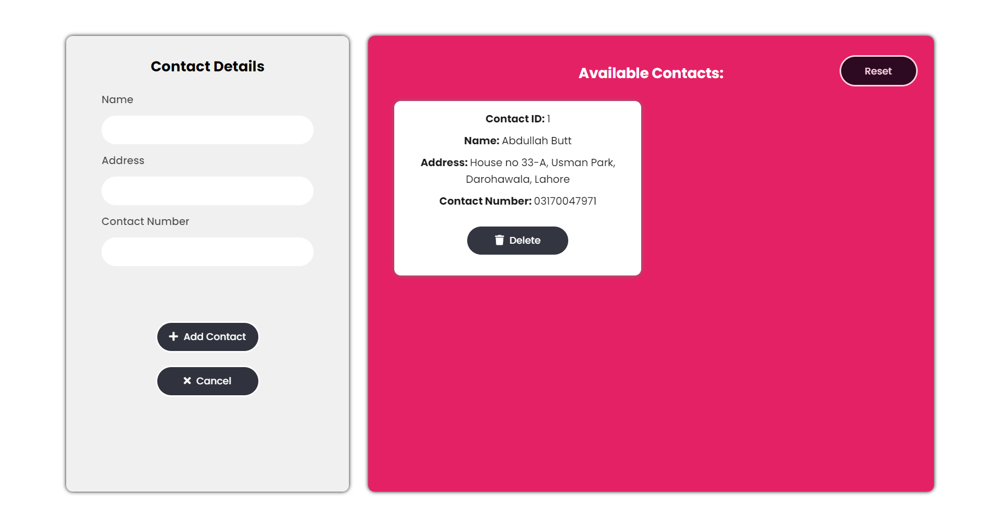

<h1 align="center">
  Contact List App 
</h1>

<h3 align="center">
  Web Application
</h3>

  

The Contact List Keeper project is a powerful and efficient web application designed to simplify and streamline the process of managing contact details. Developed using HTML, CSS, and JavaScript, this repository contains the code for a user-friendly contact list management system that utilizes local storage to store and retrieve contact information.
The primary goal of the Contact List Keeper is to provide users with a convenient and centralized platform to store and organize their contact information. With this application, users can easily add, edit, and delete contacts, ensuring that their address book remains up to date and readily accessible.
The interface of the Contact List Keeper is clean, intuitive, and visually appealing. Users are presented with a user-friendly form where they can input essential details such as the contact's name, phone number, email address, and additional notes. The application provides validation checks to ensure the accuracy of the entered information, alerting users if any fields are incomplete or contain invalid data.
  
One of the standout features of this project is the integration of local storage. With local storage, the Contact List Keeper allows users to store their contact information directly in their web browser, eliminating the need for external databases or server-side storage. This means that users can access their contact list anytime, even when offline, as the data is securely stored within their browser's local storage.
The Contact List Keeper also offers robust functionality for managing contacts. Users can easily search for specific contacts using the search feature, making it quick and effortless to find the desired contact. The application also allows for sorting contacts alphabetically, enabling users to organize their contact list based on names or other criteria.
Moreover, the Contact List Keeper provides editing capabilities, allowing users to update or modify existing contact details as needed. Users can edit any field of a contact's information and save the changes, ensuring that their contact list remains accurate and up to date.
  
Another noteworthy feature of this project is its responsiveness. The Contact List Keeper is designed to be fully responsive, ensuring that it works seamlessly across various devices and screen sizes. Whether accessing the application on a desktop computer, laptop, tablet, or smartphone, users will experience a consistent and optimized user interface.
  
In conclusion, the Contact List Keeper repository offers a comprehensive and efficient solution for managing contact details. Its use of HTML, CSS, and JavaScript, along with local storage, enables users to store, organize, and update their contact information conveniently and securely. With its user-friendly interface, validation checks, search functionality, and responsiveness, the Contact List Keeper provides a seamless and enjoyable experience for users looking to keep their contact list organized and easily accessible.

  
<!-- ................................................................................................................................. -->

### Features
 
Following are some of the new features and learning encountered while creating this amazing project:

- Local Storage Handling
- Dynamic Data Maniplation

  
<!-- ................................................................................................................................. -->

### Demo

  The Demo of this working project can be found on  
  <a href="https://rebrand.ly/ContactListApp_MABCORP">rebrand.ly/ContactListApp_MABCORP</a>

  
<!-- ................................................................................................................................. -->

### Application's Interface   

  
<!-- ................................................................................................................................. -->

### Technology Stack
 
Follwing technologies have been used at the core of this application to make it stand in the market place:

- HTML
- CSS
- JavaScript
- Local Storage

  
<!-- ................................................................................................................................. -->

### Advancement

> Nothing Yet

  
<!-- ................................................................................................................................. -->

### Deployment Details

The website is deployed using the free hosting provided by **Vercel**

  

  
Later on the link was customized using the well-known URL shortener and customizer **Rebrandly**:  

  

  
<!-- ................................................................................................................................. -->

### Developer

Muhammad Abdullah Butt  
abdullahbutt12292210@gmail.com  
> [Instagram](https://www.instagram.com/abdullah.butt.22/) 
> [FaceBook](https://www.facebook.com/profile.php?id=100076291614529) 
> [YouTube](https://www.youtube.com/channel/UCnuOFQyMywg-KuoN-lmav1Q) 
> [Portfolio](https://rebrand.ly/MuhammadAbdullahButt_MABCORP) 
> [Project Displayer]( https://rebrand.ly/ProjectDisplayer_MABCORP)
  
<!-- ................................................................................................................................. -->

